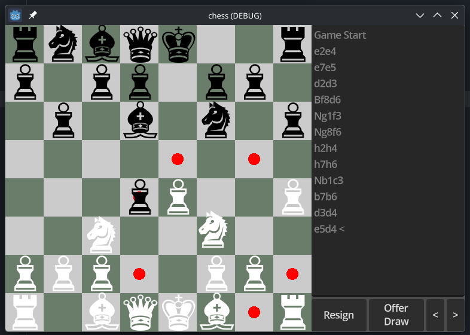

A full chess implementation in godot.

I originally created this to experiment with multiplayer networking, but the chess implementation took quite a while and I haven' finished the multiplayer portion yet. So this is incomplete.

The chess implementation has not been rigorously tested against a validator, but I believe it's an accurate recreation of all the rules of chess.

